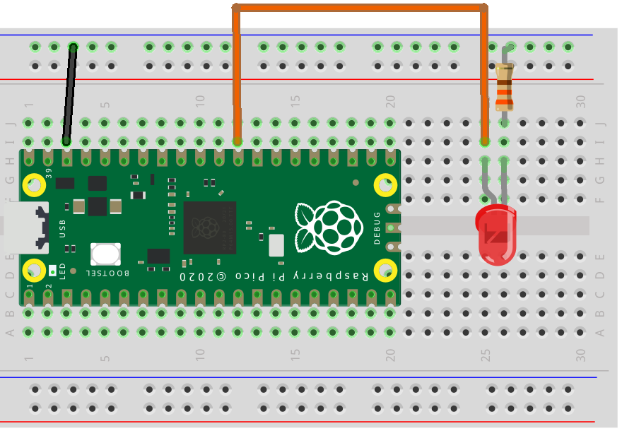
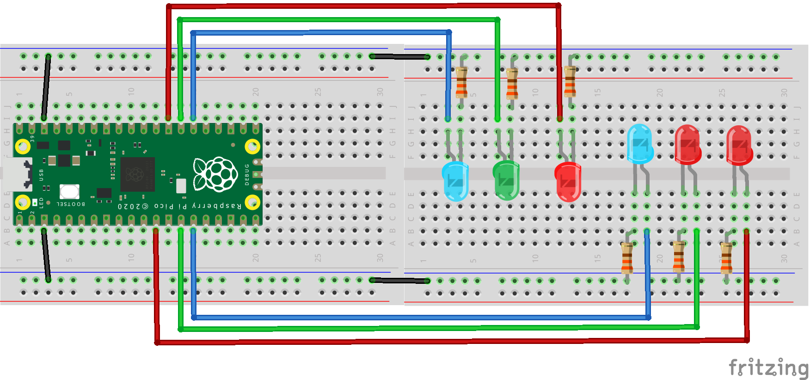
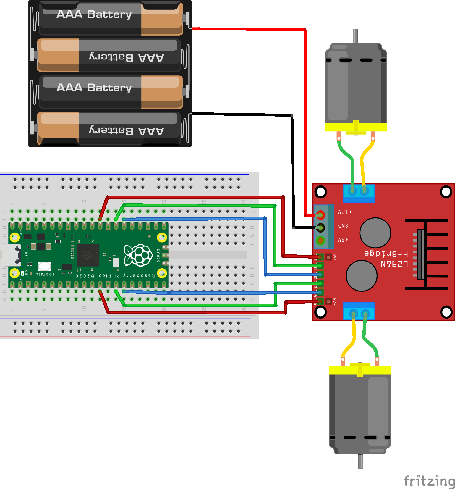
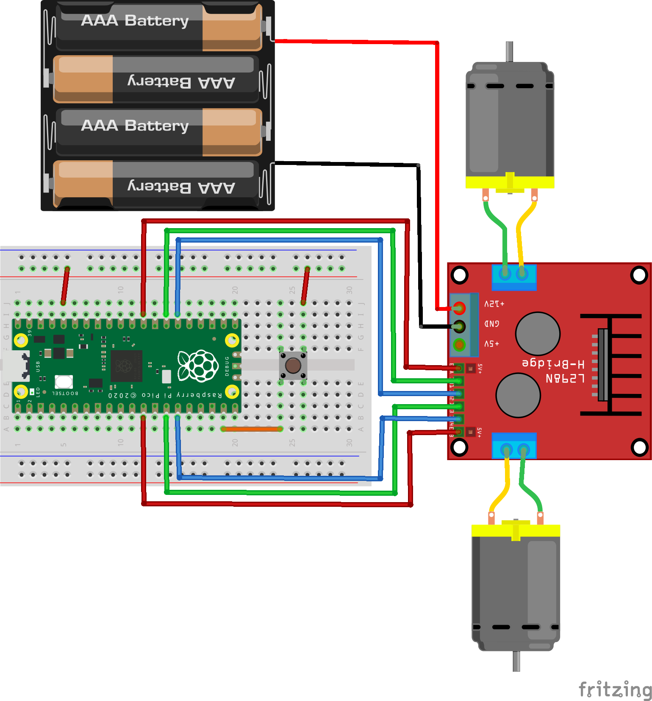

# Pico_Simple_Micropython_Rover
 Tutorial on creating a MicroPython rover using the Raspberry Pi Pico.
 
## Chapters
1. **Introduction** 
2. **Initial Code** (Python imports)
3. **Make Something Happen** (flash internal LED)
4. **Adding External LED** (breadboards and flash external LED
5. **Add Some More LED** (set up 6 LED as if rover connections)
6. **Ready for Some Wheel Action** (disconnect LED, connect the motors and Python functions)
7. **Time for Some More Action** (really take control)
8. **Random Driving Robot** (hand over the control, Python if/elif/else, while and random numbers)

## Introduction
This is to simply demonstrate utilising the Raspberry Pi Pico pins to control LED and then a rover. Each step will build on the previous giving a result as the code builds up. Take it as far as you like and learn a little along the way. Then when you have completed this take it further!

This will use:
* Pico
* Two 400 pin breadboards (though a single 800 will obviously work)
* LED of various colours
* 330 ohm resisters
* a button. 
* The rover is a very simple two motor, two wheeled one off eBay (Item #143935395134) with a 4 AA battery box
* L298N Dual H Bridge Motor Driver Board (Item #161887122068)

Or the [CamJam Edukit 3](https://thepihut.com/products/camjam-edukit-3-robotics) will also be a great starting point too.

The Raspberry Pi documentation for the Pico board describes how to get started. I will not repeat what they have already published. I suggest some reading of these to get started if the initial parts of this description are too brief.

[Getting Started with the Raspberrry Pi Pico](https://www.raspberrypi.org/documentation/pico/getting-started/)

[Getting Started with Micropython on the Raspberry Pi Pico](https://hackspace.raspberrypi.org/books/micropython-pico)

## Initial Code
Open Thonny with a new blank file. On the very bottom right of Thonny click on the text. Select **MicroPython Raspberry Pi Pico**. Select the text again which now should read **Micropython(Raspberry Pi Pico)** and select **Configure Interpreter** at the bottom of the pop up. Then select **Install or update firmware**. Connect your Pico whilst holding down the BootSel button. Ignore the pop folder of the Pico and click Install on the update screen. Close the windows and then as the Thonny editor suggests press Stop button. The MicroPython >>> tab should now show in the Shell in the bottom window.

In the blank file editor window (the top window) add the following code:

```
import machine
import time
```

These two lines will enable you to utilise these libraries of code. To make use of the parts you need of them you need to call the library into use like this:

```
builtinLed = machine.Pin(25)
```

So machine.Pin would be needed every time the code required a Pin to be initialised. To circumvent the use of the machine part every time change the two lines of code to:

```
from machine import Pin
from time import sleep
```

Now the machine. can be dropped from the lines of code. Less typing, same result. Further to this, I'd suggest an unrecommended shortcut, the Pin and sleep could be shortened like this:

```
from machine import Pin as p
from time import sleep as s
```

I wouldn't recommend this as the p and s really do not describe what they are for. Mathematicians use all manner of letters in place of various things. In software though it makes the code much easier to read if the names are descriptive. This following code would also work:

```
from machine import Pin as Pico_Pin_Number
from time import sleep as Sleeping_Beauty_sleeps_after_biting_the_apple
```

This just demonstrates that it is possible to really personalise your code. If you really want to. For now though let's keep code simple with:

```
from machine import Pin
from time import sleep
```

Now is the time to save the code. Always good to save regulary. Go to File then Save and from the pop-up select **This Computer**. Name your file something like **pico_rover.py** in your folder place of choice. There is no need to save the file to the Pico board yet. The code will run on the board without saving to it. Only when we disconnect the board later from the computer to run on the rover will you have to save onto the Pico. For now it is probably safer to keep it on the hard drive. This is just a recommendation not a rule.

## Make Something Happen
In physical computing making an LED flash is the Hello World moment. This proves we have control. Add the extra lines to your code. I have also added a comment to the code here. Comments are prefaced with a #. Anything on the same line after the # is not code, just a message to the human reader. Copy the comments if you wish but adding comments to code is good practice.

This is the complete code do not rewrite the first two lines again.

```
# A simple coding exercise to build a two wheeled rover using
# a Raspberry Pi Pico in MicroPython

from machine import Pin
from time import sleep

# Here the internal Led attached to Pin 25 is set to be called builtinLed
# It is Pin.OUT because power is going out of the board pin to the Led to light it
builtinLed = Pin(25, Pin.OUT)


builtinLed(1) # turn on (1) the LED
sleep(1)      # pause for (1) second
builtinLed(0) # turn off (0) the LED
```

Press the green arrow button on Thonny and watch the small LED on the Pico flash on for a second. Just press the arrow again to repeat. If there are any errors in the code a message will show in the Shell window. 

## Adding External LED
The next step is to add an external LED. This will demonstrate control of an external device. If an LED can be lit up then a motor can be turned on. If a motor can be turned on then a rover can move. Simple steps lead to bigger things.

Connect an LED to Pin GP22 following the diagram below. The short leg of the LED links to the resistor and ground, the long leg to GP22 pin of the Pico.



The code now needs be changed to have the new LED added to it. This time there is a small piece of code using a for loop to repeat the commands a number of times. The word flashes could be anything you like. Blinks, twinkle, toggle, Fido, it doesn't matter. Just choose a word that means something to you and the code. The range is how many from zero to 4 but not including four. 0, 1, 2, 3 so still four times. Computers count from zero not one. Try changing the (4) to (1,4). This time the range is from one to four. But it doesn't include four, the count is just 1, 2, 3.

Also note that the code after the for line is indented in by a tab or four spaces. If the colon : at the end of the line is not ommitted then Thonny should indent automatically for you.

The new LED has been labelled red because that was the colour of the first LED I put in the board. It could, of course, have been green or blue. I hope you are getting the idea about making sensible labelling.

```
# A simple coding exercise to build a two wheeled rover using
# a Raspberry Pi Pico in MicroPython

from machine import Pin
from time import sleep

builtinLed = Pin(25, Pin.OUT)
red = Pin(22, Pin.OUT)

# Simple indication to show Pico is powered and script is running
builtinLed(1)

for flashes in range(4):
    red(1)
    sleep(0.5)
    red(0)
    sleep(0.5)
```

Run the code. This time the built in LED will just light up and the external LED will flash four times. Make it flash more times by changing the range value. ALter the sleep value as well to change the flash rate.

## Add Some More LED
The next step is to add five more LED. Ideally have three sets of colours as they will be paired later. The LED will represent the connections to the Motor Driver Board of your rover. By switching the LED, the commands will be the same as switching the motors on and off. The same as driving the rover forwards, backwards, left, right or stop. Build your board up as in the diagram. So that the wiring is simpler on the rover use one side of the board for each side of the rover. I used two small boards because that is what I had available. The wires in the middle are just to join them together.



The LED names have been changed to indicate the side of the rover they will power and the colour. The code for the six LED to roll through a dual pattern of flashes is this:

```
# A simple coding exercise to build a two wheeled rover using
# a Raspberry Pi Pico in MicroPython

# import two libraries to access the board and utilise timing
from machine import Pin
from time import sleep

builtinLed = Pin(25, Pin.OUT) 

redL = Pin(22,Pin.OUT)
redR = Pin(9, Pin.OUT)

greenL = Pin(21, Pin.OUT)
greenR = Pin(10, Pin.OUT)

blueL = Pin(20, Pin.OUT)
blueR = Pin(11, Pin.OUT)

# Simple indication to show Pico is powered and script is running
builtinLed(1)

for flashes in range(4):
    redL(1)
    redR(1)
    sleep(0.5)
    redL(0)
    redR(0)
    greenL(1)
    greenR(1)
    sleep(0.5)
    greenL(0)
    greenR(0)
    blueL(1)
    blueR(1)
    sleep(0.5)
    blueL(0)
    blueR(0)
```

Try changing the sleep values to make the flashes shorter or longer. Change the switching around to create other patterns. Adjust the value of range to make the loop longer if need be.

## Ready for Some Wheel Action

The time has come to add the Pico to the rover. Instead of LED the connections shall be to the Motor Driver Board. The Pico must not be connected directly to any motor. The current draw from the motors is too much for the board to deal with. The driverboard switches a more powerful current from commands from the Pico. Keeping the Pico safe.

The connections for the LED are now swapped for connections with the Motor Driver Board. Each connection has a different effect. Each motor has three wires. When the wires are switched live in the correct combination the motor acts in five different ways. The table below should help with this.

| Enable | Forward | Reverse | Result |
| -------|---------|---------|--------|
| Off | Off | Off | Stop |
| On | On | Off | Forwards |
| On | Off | On | Backwards |
| On | On | On | Fast Stop |
| On | Off | Off | Fast Stop |

The Enable is really the on/off switch to the motors. If Enable is powered then the motors are on and something could happen. Without turning the motors on the rover will go nowhere. The difference between Stop and Fast Stop is subtle. If you need to stop your rover quickly, to stop driving into a wall maybe, then Fast Stop is better.

A motor direction is just the direction of that one motor. The rover has two motors. Both need to be turning forwards to make the whole rover move forwards. Otherwise it would just turn on the spot. And if the motors are turning in opposite directions it can spin on the spot. Once you have full control, how you drive it is up to you!

To drive the motors successfully requires three instructions to each motor. Six in total for each manoeuvre, which will soon add up to a lot of lines of code! To simplyfy matters and to reuse code as much as possible it is better to place each switching into a function.

Functions are defined at the top of the script before they are needed to be used. The name of a function is up to the you but make it relevant to its function. There are two important points here to take note of. The colon : at the end of the line indicates the beginning of the function's code. Any line after that indented in by a tab or four spaces will be part of that function until the first line that is not indented in. Just like the for code previously for the 'for - range' line. The pattern of a basic function is this:

```
def functionName():
    # here goes the code to work
```

And functions can call other functions into use. So a function for the rover to go forwards can have two functions for each motor to go forwards. So the code to make the rover to go forward could now start to look like this. The Pico is still set up with the LED at this point.

```
# A simple coding exercise to build a two wheeled rover using
# a Raspberry Pi Pico in MicroPython.

# import two libraries to access the board and utilise timing
from machine import Pin
from time import sleep

builtinLed = Pin(25, Pin.OUT)

enable_L = Pin(22,Pin.OUT)
enable_R = Pin(9, Pin.OUT)

forward_L = Pin(21, Pin.OUT)
forward_R = Pin(10, Pin.OUT)

reverse_L = Pin(20, Pin.OUT)
reverse_R = Pin(11, Pin.OUT)

# Simple indication to show Pico is powered and script is running
builtinLed(1)

# define only the left motor to go forwards
def left_forwards():
    enable_L(1)
    forward_L(1)
    reverse_L(0)

# define only the right motor to go forwards
def right_forwards():
    enable_R(1)
    forward_R(1)
    reverse_R(0)

# define only the left motor to stop
def left_stop():
    enable_L(1)
    forward_L(0)
    reverse_L(0)

# define only the right motor to stop
def right_stop():
    enable_R(1)
    forward_R(0)
    reverse_R(0)

# define rover going forwards using both motors forwards
def rover_forwards():
    left_forwards()
    right_forwards()

# define both motors to stop
def rover_stop():
    left_stop()
    right_stop()

# Calls to the functions to make the rover actually move
rover_forwards()  # go forwards
sleep(5)          # for 5 seconds
rover_stop()      # then stop
```

With the LED still connected they will flash in the correct order to simulate the rover's motors switching on and off. The Raspberry Pi Pico can now be installed onto your rover and the LED connections connected to those of the motor driver board. To test it works **support the rover off the desk** otherwise it will drive off onto the floor as soon as the code is run.

When the code is run and the motors seem to rotate in the opposite direction to that expected - swap the motor connections around.



## Time for Some More Action
All the basic commands are now available to control the rover. Extra functions for reversing the wheels are required to make your rover go backwards and to turn. These are created just by copying the previous functions and swapping the commands around. All the functions needed are these. Add those **not there already** to your code.

```
# define left motor going forwards
def left_forwards():
    enable_L(1)
    forward_L(1)
    reverse_L(0)
    
# define left motor going backwards
def left_reverse():
    enable_L(1)
    forward_L(0)
    reverse_L(1)

# define right motor going forwards
def right_forwards():
    enable_R(1)
    forward_R(1)
    reverse_R(0)
    
    # define right motor going backwards
def right_reverse():
    enable_R(1)
    forward_R(0)
    reverse_R(1)

# define left motor to stop
def left_stop():
    enable_L(1)
    forward_L(0)
    reverse_L(0)

# define right motor to stop
def right_stop():
    enable_R(1)
    forward_R(0)
    reverse_R(0)

# define both motors to go forwards
def rover_forwards():
    left_forwards()
    right_forwards()

# define both motors to go in reverse
def rover_reverse():
    left_reverse()
    right_reverse()

# define both motors to stop
def rover_stop():
    left_stop()
    right_stop()

# define a right turn
def right_turn():
    left_forwards()
    right_reverse()

# define a left turn
def left_turn():
    left_reverse()
    right_forwards()
```

All that is left is to write a series of commands for the rover to follow. A zig zag kind of drive could be this:

```
sleep(5)      # a short pause after powering up before the motor starts
rover_forwards()
sleep(2)
rover_stop()
sleep(0.5)
right_turn()   # the sleep time here is for the turn
sleep(0.5)     # the amount will vary from my rover to yours
rover_stop()
sleep(0.5)
rover_forwards()
sleep(2)
left_turn()
sleep(0.5)
rover_stop()
rover_forwards()
sleep(2)
rover_stop()
right_turn()
sleep(1)
rover_reverse()
sleep(2)
rover_stop()
```

This can be tested on the desk but it would be much more fun on the floor. Save the file to the Pico this time with Save As and select the Pico and **rename it as main.py**. Only files named main.py will run when the Pico is powered away from a computer. Power the Pico with a small phone powerbank, the AA batteries will still power the motor. You should now have a rover that will drive around.

Change the sequence of commands to drive around in the pattern of your own design.

## Random Driving Robot
Developing the Python learning further with the use of random and lists it is possible to make the rover drive around by itself. By adding a button and importing the random module the rover can produce a series of movements on its own.

Add the button to the breadboard connecting it to Pin 14 of the Pico. Add this line to the other pin definitions at the top of the code.

```
button = Pin(14, Pin.IN)
```



The rover will now be set up so that when the button is pressed a series of 4 random numbers will be generated. Each number refers to either one of the four possible rover moves. A new function selects which motor function is called depending on which random number is generated. Place this function at the bottom of the previous ones. (Or the top or middle, it doesn't really matter to Python).

```
def move_rover(moves):
    if moves == 1:
        rover_forwards()
        sleep(1)
    elif moves == 2:
        rover_reverse()
        sleep(1)
    elif moves == 3:
        right_turn()
        sleep(0.6)
    else:
        left_turn()
        sleep(0.6)
    rover_stop()
```

This function is different from others because it is receiving a value from the call. This value (or argument) is then used within the function. The value will be assigned the variable name of moves and will be either 1, 2, 3 or 4. If the value is 1 then the function calls the rover_forwards function to operate then pauses (sleeps) for a second. As the value was a 1 then the next three elif (else if) lines are ignored. The final line calls the function rover_stop to work. So the rover has move forwards for a second and then stopped.

If the moves value is a 3 then the first if check is false. So is the elif 2. But the elif 3 is True so the right_turn function is called. If the value is a 4 then all the if and elif are False so the catch all else is used and the rover turns left. With if/elif/else commands any checks after the first line that passes True are ignored even if they may pass as True. But when if/if/if/else are used instead each if is checked in turn. Subtly different.

The commands this time will be enclosed in a forever while loop. This will run for as long as the power is supplied to the Pico. Inside the loop the code checks to see if the button is pressed. If it has been pressed then the code generates a series of random numbers sending the number to the above function to drive the rover. 

```
while True:
    if button.value() == 1:
        builtinLed(0)  # indicates the button has pressed and this part of the code is running
        for moves in range(10):
            movement = randint(1,4)
            move_rover(movement)
            sleep(2)
        builtinLed(1)  # indicates the loop has finished and the button is ready to be pressed again
```

The loop works like this:
1. The loop runs forever because while is True. It will never be False as it states it is True. While this is True do what follows.
2. The button.value can be either zero if not pressed or one if pressed. So if the value is one then this line is True and the following lines run. If not then the while loop loops around and checks again, and again...
3. The builtin LED is switched off to indicate to the user that the code is running.
4. A series of numbers from 0 to 9 are generated in a loop. The code does not use them but it provides a way of repeating something a defined number of times.
5. A number, either 1, 2, 3 ror 4 is generated and set to the variable movement.
6. The move_rover function is called and the value of movement generated in the previous line sent with the call.
7. A pause to allow the drive or turn to operate before getting the next move.
8. Once 10 moves have run the loop terminates and the builtin LED illuminates.

So now you have the complete code, repeated below. Save it to the Raspberry Pi Pico as main.py again. Plug in the powerbank and press the button. Have fun!

```
# A simple coding exercise to build a two wheeled rover using
# a Raspberry Pi Pico in MicroPython.

# import two libraries to access the board and utilise timing
from machine import Pin
from time import sleep
from random import randint


# Set up definitions of pins being used
builtinLed = Pin(25, Pin.OUT)

enable_L = Pin(22,Pin.OUT)
enable_R = Pin(9, Pin.OUT)

forward_L = Pin(21, Pin.OUT)
forward_R = Pin(10, Pin.OUT)

reverse_L = Pin(20, Pin.OUT)
reverse_R = Pin(11, Pin.OUT)

button = Pin(14, Pin.IN)

# Simple indication to show Pico is powered and script is running
builtinLed(1)

# define left motor going forwards
def left_forwards():
    enable_L(1)
    forward_L(1)
    reverse_L(0)
    
# define left motor going backwards
def left_reverse():
    enable_L(1)
    forward_L(0)
    reverse_L(1)

# define right motor going forwards
def right_forwards():
    enable_R(1)
    forward_R(1)
    reverse_R(0)
    
    # define right motor going backwards
def right_reverse():
    enable_R(1)
    forward_R(0)
    reverse_R(1)

# define left motor to stop
def left_stop():
    enable_L(1)
    forward_L(0)
    reverse_L(0)

# define right motor to stop
def right_stop():
    enable_R(1)
    forward_R(0)
    reverse_R(0)

# define both motors to go forwards
def rover_forwards():
    left_forwards()
    right_forwards()
    
def rover_reverse():
    left_reverse()
    right_reverse()

# define both motors to stop
def rover_stop():
    left_stop()
    right_stop()

# define a right turn
def right_turn():
    left_forwards()
    right_reverse()

# define a left turn
def left_turn():
    left_reverse()
    right_forwards()
    
def move_rover(moves):
    if moves == 1:
        rover_forwards()
        sleep(1)
    elif moves == 2:
        rover_reverse()
        sleep(1)
    elif moves == 3:
        right_turn()
        sleep(0.6)
    elif moves == 4:
        left_turn()
        sleep(0.6)
    rover_stop()
    
# Simple indication to show Pico is powered and script is running
builtinLed(1)

while True:
    if button.value() == 1:
        builtinLed(0)
        for moves in range(10):
            movement = randint(1,4)
            move_rover(movement)
            sleep(2)
        builtinLed(1)
```
